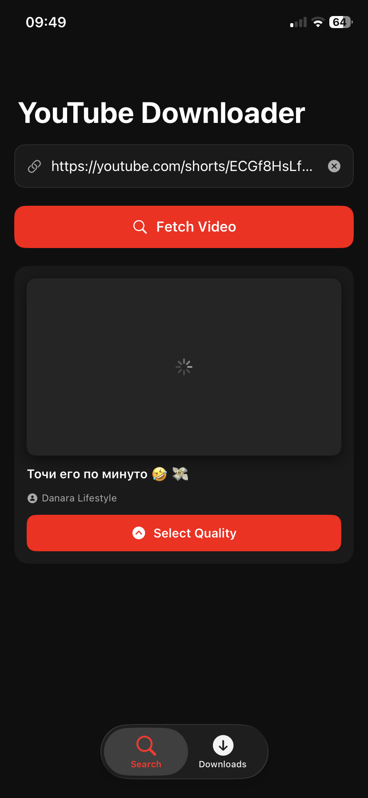
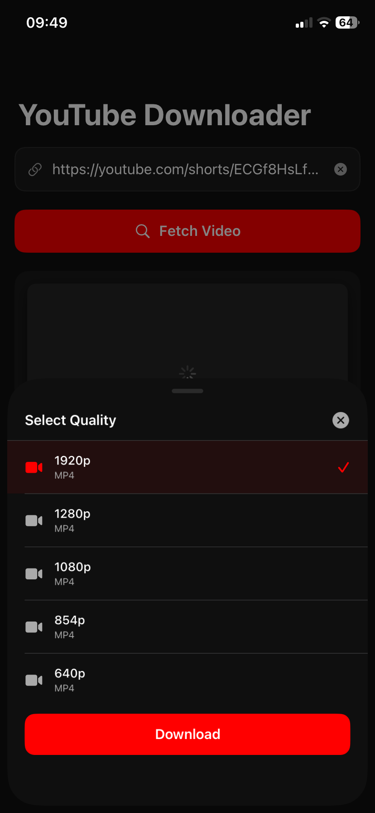
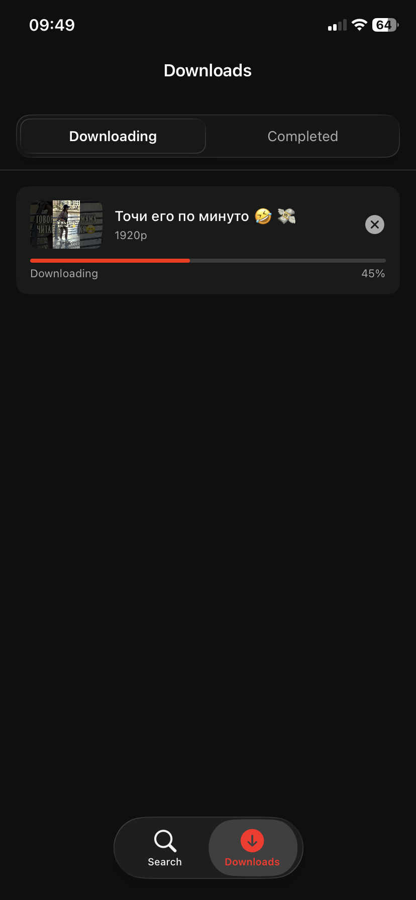
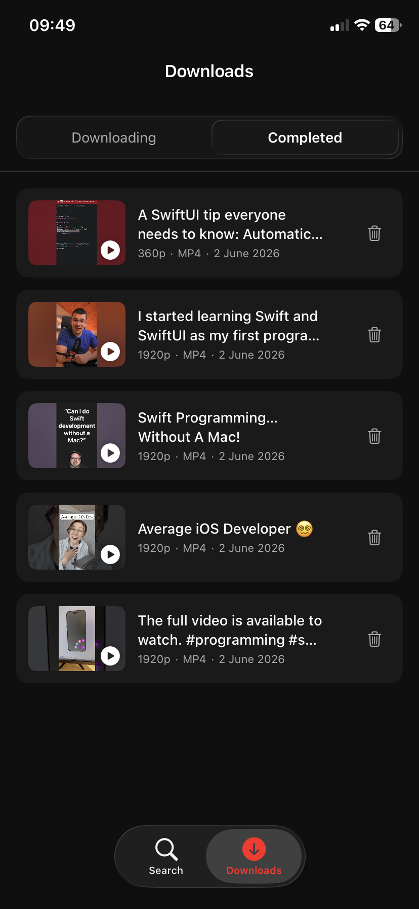
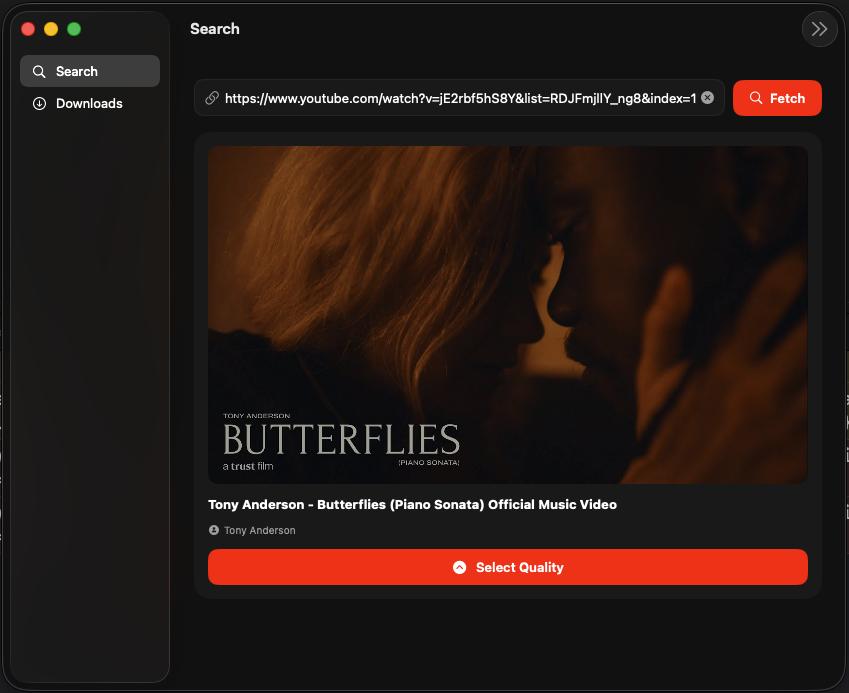
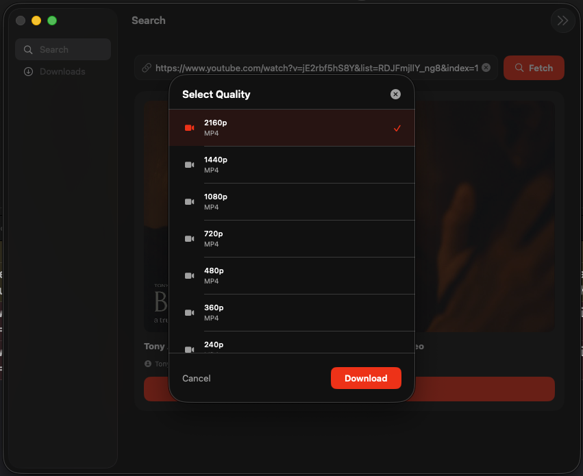
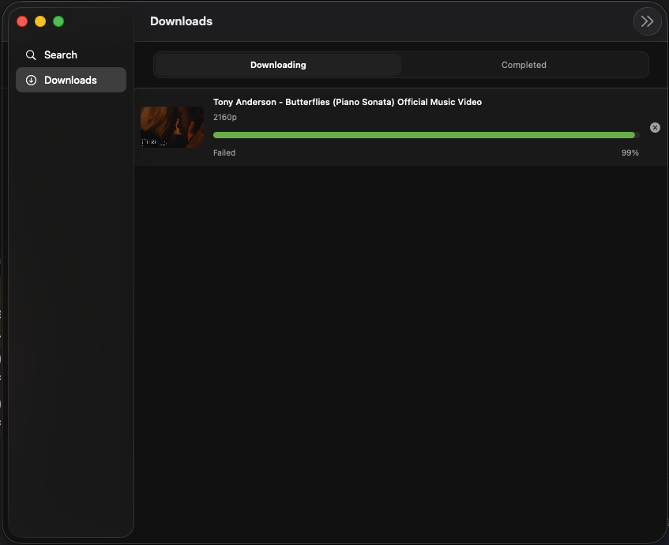
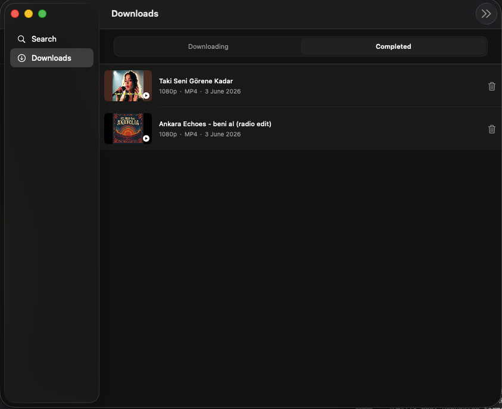

# YouTube Downloader

A YouTube downloader for iOS and macOS with a Python backend for full quality support (1080p, 720p, 4K).

## Screenshots

### iOS

<p float="left">
  
  
  
  
</p>

### macOS

<p float="left">
  
  
</p>
<p float="left">
  
  
</p>

## Structure

```
├── apple-ios-macos/        # SwiftUI app (iOS 17+ / macOS 14+)
├── python-backend-downloader/  # FastAPI + yt-dlp backend
└── docs/                   # Documentation
```

## Features

- Search and fetch YouTube video info
- Download in all available qualities (1080p, 720p, 480p, 360p, audio-only)
- Built-in video player with seek, play/pause, save to Photos
- Downloads persist across app launches (SwiftData)
- Thumbnail caching for offline viewing
- iOS 26 liquid glass UI

## Architecture

### iOS / macOS App
- SwiftUI multiplatform (single target, `#if os(iOS)` guards)
- MVVM with repository pattern
- `@Observable` + `@MainActor` ViewModels
- SwiftData for download metadata persistence
- `AsyncThrowingStream` for download progress

### Backend
- FastAPI + yt-dlp
- 3-tier architecture (Web → Service → Data)
- Downloads and merges video+audio streams via ffmpeg
- See [docs/backend.md](docs/backend.md) for full API reference

## Setup

### Backend (local)

```bash
cd python-backend-downloader
python3 -m venv venv
source venv/bin/activate
pip install -r requirements.txt
uvicorn main:app --host 0.0.0.0 --port 8000 --reload
```

### ngrok tunnel (for real device testing)

```bash
ngrok http --url=YOUR_STATIC_DOMAIN.ngrok-free.dev 8000
```

Update `apple-ios-macos/youtube-downloader/Shared/Config.swift` with your URL.

### iOS App

Open `apple-ios-macos/youtube-downloader.xcodeproj` in Xcode, select your device, build and run.

## Distribution

- Backend: Hugging Face Spaces (Docker) at `https://azizbibitov-yt-downloader-backend.hf.space`
- iOS: Internal TestFlight (up to 100 testers, no App Store review)
- Keep-alive: GitHub Actions pings backend every 12 hours (`.github/workflows/keep-alive.yml`)
